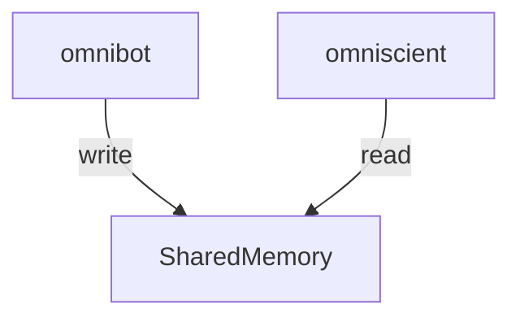

+++
title = "omniscient"
description = "self contained rust web application to 'strictly' observe a Raspberry Pi three wheeled omnidirectional bot"
date = "2025-04-25"

[taxonomies]
tags = ["rust", "axum", "shared memory", "raspberry pi", "ipc"]

[extra]
repo_view = true
comment = true
+++

[GitHub](https://github.com/nuttycream/omniscient)

# omniscient

A pair program for the OmniBot that uses IPC and WebSockets to give us near
real-time updates from our bot

## what does it do?

the premise of this web app, is to read from shared memory from the bot



## shared memory structure

```c
typedef struct {
    int ver;
    int direction;
    int motor_power[3];
    int obstacle;

    int go_left;
    int go_right;

    int sensors[4];
} Shared;
```
